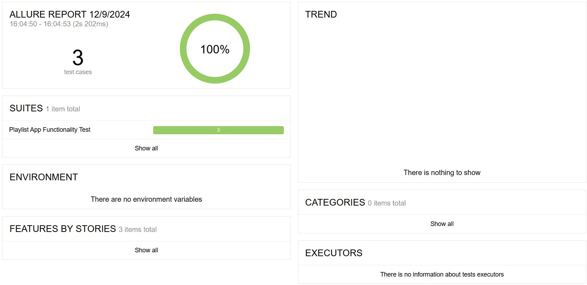
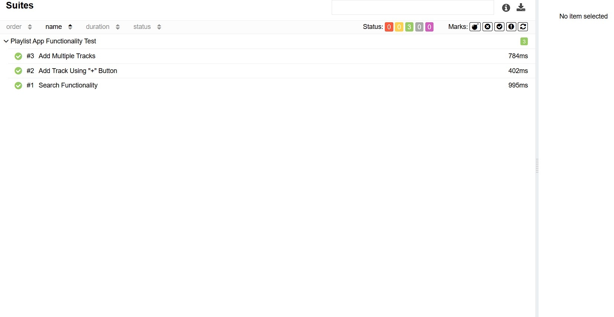

## Playlist App Functionality Test

**Objective:**

This project is a test suite for a [music playlist web](https://vite-react-alpha-lemon.vercel.app/) application using Cypress. It includes tests for searching tracks, adding tracks using a button, and adding multiple tracks using checkboxes. The project also generates detailed test reports using Allure.

**Tools:**  
- Cypress (for automated testing)
- JavaScript
- Page Object Model (POM) for organizing tests
- Allure (for reporting)
- GitHub Pages (for hosting reports)

**Project Structure:** 

`cypress/config/playlist_сonfig.js`  - file containing data. 

`cypress/e2e/pages/playlist_page.js` - contains methods for interacting with the main page of the website.  

`cypress/e2e/tests.cy.js`            - contains tests that verify the app functionality. 

**Scripts:** 

`npm run`

- `test`: Runs the Cypress tests locally with the specified configuration.

- `open`: Runs the Cypress tests in the default browser.

- `allure:generate`: Generates the Allure report from the test results.

- `allure:open`: Opens the Allure report in the default browser.

- `clear`: Clears the reports directory.

**Allure Reporting:**

Allure is used for generating detailed test reports, providing insights into test results, and making it easier to understand the test execution and outcomes.

  

**GitHub Pages:** 

The project utilizes GitHub Pages for hosting and displaying the test reports. You can view the test reports [here](https://gadiim.github.io/PlaylistAppCypressAllure/)

